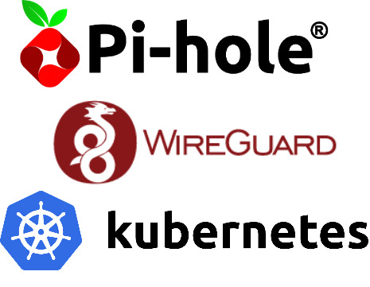
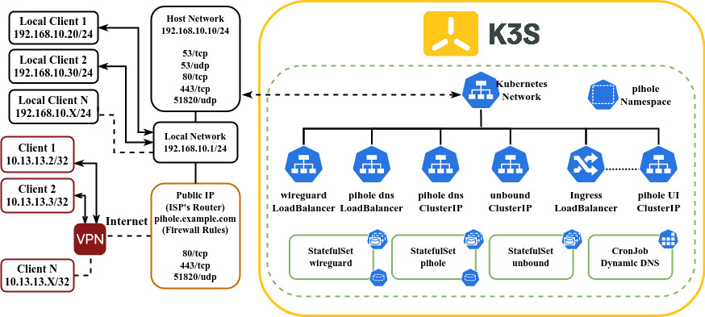
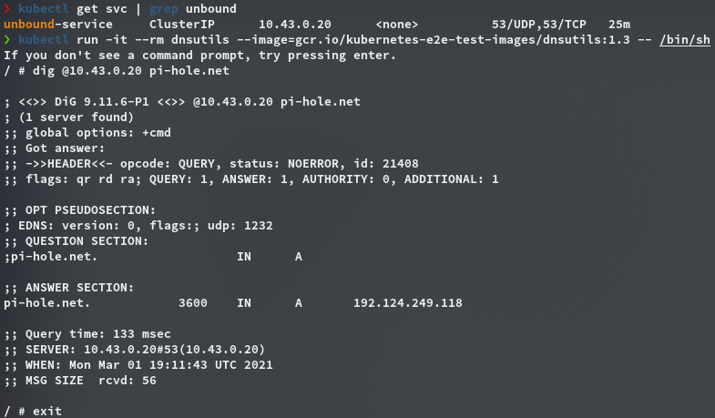
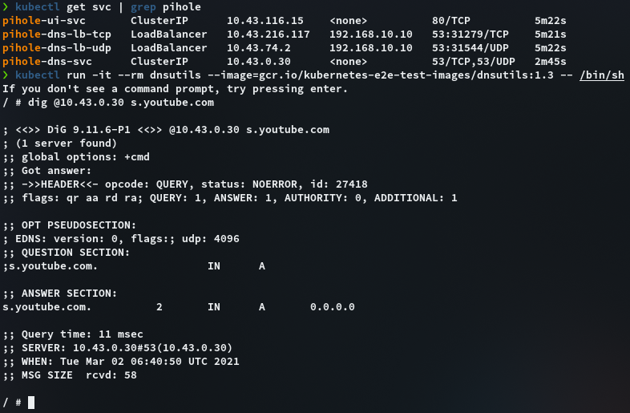
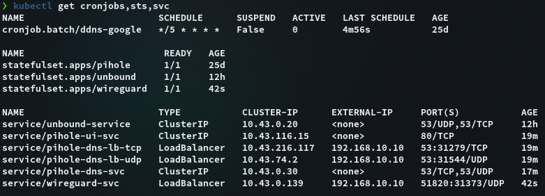
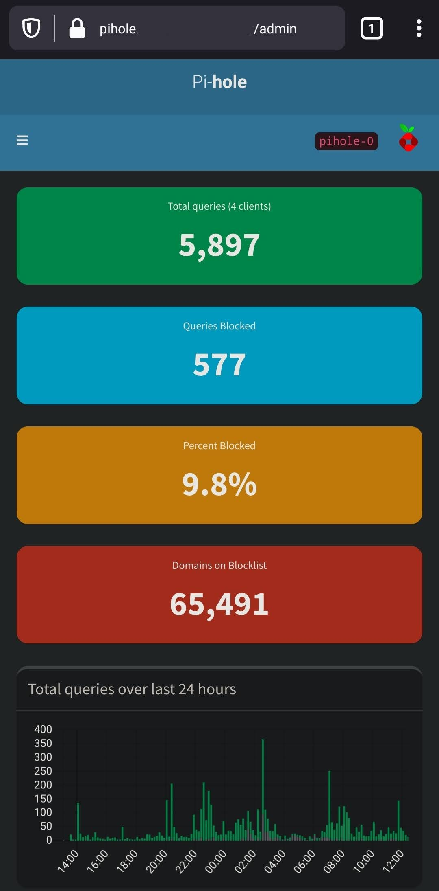

# Deploy pihole and wireguard on kubernetes using a recursive dns



In this tutorial we gonna deploy a dns add-blocker with pihole using a recursive dns as upstream server accessible in LAN network and internet through wireguard vpn. We utilized [K3S](https://k3s.io) as kubernetes provider.

## Assumptions

To follow this tutorial you need to have:
  - A computer running any linux distribution (in this tutorial I'm using debian buster)
  - This computer needs to have at least 1 Gb of ram and 2 cores.
  - This computer needs to have an static ip address (in my case 192.168.10.10, LAN: 192.168.10.1/24)
  - Configure the firewall to accept inbound connections in the following ports:
    - 53/tcp
    - 53/udp
    - 80/tcp
    - 443/tcp
    - 51820/udp
  - In order to connect from internet, you need to open the following ports in your ISP's Router:
    - 80/tcp (Pihole Web Interface HTTP) 
    - 443/tcp (Pihole Web Interface HTTPS) 
    - 51820/tcp (Wireguard VPN) 
  - In order to connect to pihole via web UI from internet you need to have a `FQDN` that points to your Network (in this tutorial I'm using google domains, you can use [duckdns](https://www.duckdns.org/) if you don't have a domain)
  - A functional K3S cluster (See [Installation guide](https://rancher.com/docs/k3s/latest/en/installation/install-options/)). This tutorial should work with K8S, but you need to deploy some extra features like Traefik Ingress, Klipper Service Load Balancer
  - You need to have `kubectl` to perform operations in the K3S cluster

## Diagram

In the following image you can see the diagram that we want to implement. We can access to pihole in our local network (192.168.10.1/24) and access to admin interface through internet, finally we can access to cluster resources via VPN trough Wireguard or just route dns queries.


## Resources
All manifests are in this [GitHub repository](https://github.com/ivanmorenoj/k3s-pihole-wireguard) feel free to clone and customize

# Methodology

## Namespaces
The first thing that we need to configure is the `namespace` we need to create 2 namespaces: `pihole` for pihole, unbound and wireguard. `cert-manager` to deploy a cert manager in order to enable HTTPS on pihole UI interface.

```sh
$ kubectl apply -f k8s/01-namespaces.yaml
```

## Dynamic DNS
If you don't have assigned an static ip address, you can point to your public ip provided by your ISP using a dynamic dns, in my case I'm using a google domains, so i can update the subdomain with curl. I created a `cronJob` that updates every 5 min the public ip assigned by my ISP.

```sh
$ kubectl apply -f k8s/02-dynamic-dns-google.yaml
```

## Unbound
Unbound is a validating, recursive, caching DNS resolver. In order to resolve a dns query unbound queries to the root domain (.com), then queries to subdomain (example.com) and keeps doing til it found the desire domain (pihole.example.com). Is very useful to avoid some type of tracking in the popular dns servers (like google). In this tutorial we utilize this image [mvance/unbound](https://hub.docker.com/r/mvance/unbound) that comes pre-configured to works as recursive dns.

This manifest comes with:
- unbound `StatefulSet` configured as recursive DNS resolver
- Cluster IP service to 53/tcp and 53/udp

```sh
$ kubectl apply -f k8s/03-unbound.yaml
```

### Test Unbound installation


## Create directories
To store config files you need to create 2 directories in the master node.

```sh
$ sudo mkdir -p /var/lib/{pihole,wireguard}
```

## Pihole 
Pihole (as you probably already know) is a dns add blocker. In order to configure Pihole and make accessible in LAN network we need to configure a `LoadBalancer` service in 53/tcp-udp that binds in the local host. The web UI will be accessible through Ingress controller (If you don't want that just use a `NodePort` service in `pihole-ui-svc`)

This manifest comes with:
- Persistent volume type `hostPath` (`/var/lib/pihole`)
- Persistent Volume claim
- Config Map (Timezone, admin email and upstream dns)
- Secret (Web Password)
- Pihole `StatefulSet`
- Cluster IP Services (Pihole UI, Pihole DNS)
- `LoadBalancer` Services (Pihole DNS bind to host)

You need to configure:
- Time Zone (pihole-configmap)
- Admin email (pihole-configmap)
- Web Password (pihole-secret)

```sh
$ kubectl apply -f k8s/04-pihole.yaml
```
### Test Pihole installation


## WireGuard
WireGuard is a modern VPN server that works at kernel level. In this tutorial we utilize the vpn to access at LAN resources from internet or just to encrypt the dns queries to our pihole installation from internet.

This manifest comes with:
- Persistent volume type `hostPath` (`/var/lib/wireguard`)
- Persistent Volume claim
- Config Map (Timezone, server url, number of peers, etc)
- Wireguard `StatefulSet`
- `LoadBalancer` Service (Wireguard listen port 51820/udp)

You need to configure:
- Timezone (wireguard-configmap)
- Server URL (wireguard-configmap)
- Number of peers (wireguard-configmap)

```sh
$ kubectl apply -f k8s/05-wireguard.yaml
```
### Wireguard Client config

You can see the logs of your wireguard pod to get the QR code for each peer as is showed in the following image


You can also copy the config files for each peer located at `/var/lib/wireguard/config/peer<N>/peer<N>.conf`


# Extra (Ingress Configuration for Pihole UI)
This steps describe how to make the Pihole Web User Interface available from internet `HTTP/HTTPS` using `Traefik` Ingress. If you don't want that, just use a `NodePort` service in `pihole-ui-svc`. 

## Deploy cert-manager
We need to deploy a cert manager to serve TLS certificates for HTTPS.

```sh
$ kubectl apply -f https://github.com/jetstack/cert-manager/releases/latest/download/cert-manager.yaml
```
## Deploy Cluster Issuer (Let's Encrypt)
This manifest deploy a cluster issuer that points to Let's encrypt. You need to configure the email to get notifications.
```sh
$ kubectl apply -f k8s/06-cluster-issuer-letsencrypt.yaml
```

## Ingress
This manifest comes with the domain of your pihole host. You need to configure the subdomain previously configured.

```sh
$ kubectl apply -f k8s/07-ingress.yaml
```

# How to use
You can change your LAN `DNS` servers to point to your pihole installation. If you're in a VPN by default you route all of your traffic trough wireguard including your dns queries. If you only want to route your dns queries through wireguard you should only route the following routes in `AllowedIPS`: `10.0.0.0/8`, `192.168.10.0/24` (replace whit your local network CIDR).

If you have been following this tutorial so far you will see the following resources on your kubernetes cluster


And the Pihole admin User Interface accessible through internet via `FQDN`

